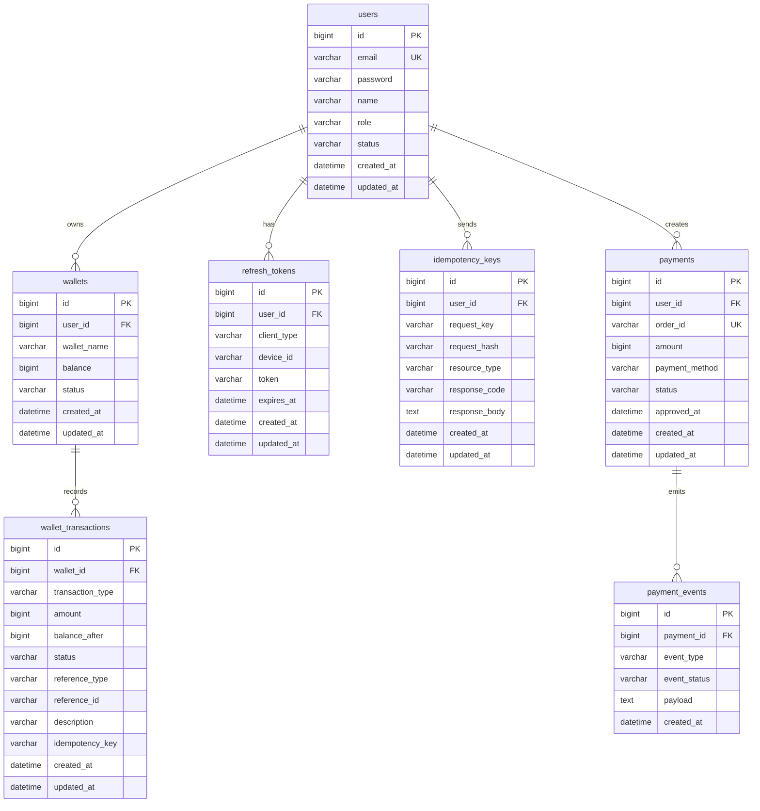

# 지갑 시스템 ERD 초안

## 개요

현재 설계는 `wallet-service`와 `payment-service`가 같은 MySQL 데이터베이스를 공유하는 구조를 기준으로 작성했습니다.

- `wallet-service`
  - 회원가입 및 로그인
  - 지갑 생성 및 잔액 관리
  - 포인트 사용 및 사용 취소
  - 거래 원장 관리
  - 중복 요청 방지
- `payment-service`
  - 충전 요청 생성
  - 결제 상태 관리
  - 모의 결제 승인 처리
  - 결제 이벤트 기록

이번 설계의 핵심 전제는 아래와 같습니다.

- 사용자 1명은 여러 개의 지갑을 가질 수 있다
- 현재 잔액은 빠른 조회를 위해 별도 저장한다
- 금액 변화는 모두 거래 원장에 기록한다
- 충전은 결제 테이블과 연결된다
- 금액 관련 API는 멱등성 처리를 고려한다

## 엔티티 설명

### users

- 회원 계정 정보를 저장하는 테이블
- 이메일은 유일해야 한다
- 상태값으로 활성/비활성 제어가 가능하다

### wallets

- 사용자와 1:N 관계를 가진다
- 사용자별로 여러 개를 가질 수 있다
- 현재 잔액을 저장한다
- 필요 시 지갑 잠금 같은 상태 제어가 가능하다
- 지갑 이름으로 구분할 수 있다

### wallet_transactions

- 지갑 거래 원장 테이블
- 충전, 사용, 취소, 수동 조정 이력을 기록한다
- `balance_after`를 저장해 디버깅과 포트폴리오 설명에 유리하다
- `reference_type`, `reference_id`로 외부 비즈니스 이벤트와 연결할 수 있다

### refresh_tokens

- JWT 리프레시 토큰 저장용 테이블
- 로그아웃, 토큰 재발급, 다중 기기 대응 시 유용하다
- 웹/앱 동시 로그인 같은 멀티 세션을 관리할 수 있다
- `client_type`, `device_id`로 세션을 구분한다

### idempotency_keys

- 중복 요청 방지용 테이블
- 사용, 충전, 취소 요청의 재처리를 막기 위해 사용한다
- 요청 식별값과 응답 요약 정보를 저장한다

### payments

- 충전 결제 요청과 결제 상태를 관리하는 테이블
- `payment-service`의 핵심 테이블이다
- 승인 완료 후 `wallet_transactions`와 연결될 수 있다

### payment_events

- 결제 흐름에서 발생한 이벤트를 저장하는 테이블
- 요청 생성, 승인, 실패, 취소 같은 상태 변화를 기록한다
- 추후 Kafka 연동 전후의 추적 포인트로도 활용 가능하다

## 관계 요약

- `users` 1 : N `wallets`
- `wallets` 1 : N `wallet_transactions`
- `users` 1 : N `refresh_tokens`
- `users` 1 : N `idempotency_keys`
- `users` 1 : N `payments`
- `payments` 1 : N `payment_events`

## Mermaid ERD

## 설계 메모

- 포인트/금액 데이터는 부동소수점보다 `BIGINT`를 쓰는 편이 안전합니다.
- `wallet_transactions`는 append-only 성격으로 운영하는 것이 좋습니다.
- 취소는 기존 거래를 삭제하지 않고 새로운 취소 거래를 추가하는 방식이 적합합니다.
- 충전 완료 후에는 `wallet_transactions.reference_type='PAYMENT'`와 `reference_id=<paymentId>` 형태로 결제와 연결할 수 있습니다.
- 같은 DB를 사용하더라도 서비스 책임은 코드 레벨에서 분리하는 것이 좋습니다.
- 기본 정책은 회원가입 시 기본 지갑 1개를 생성하고, 구조는 여러 지갑을 가질 수 있도록 열어두는 방식이 무난합니다.
- `refresh_tokens`는 사용자당 1개가 아니라 세션/기기별로 여러 개 저장하는 구조가 웹과 앱 동시 로그인에 유리합니다.
